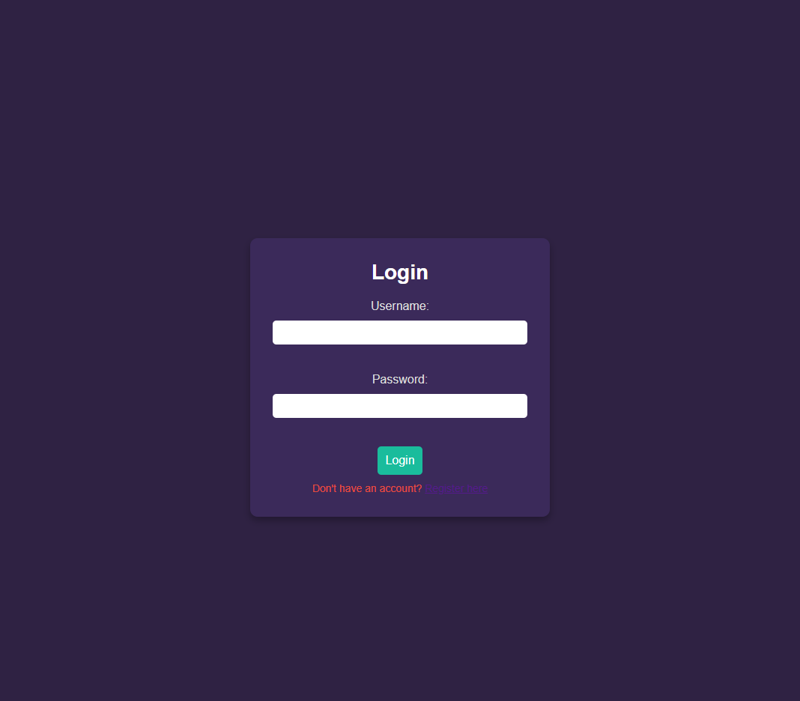
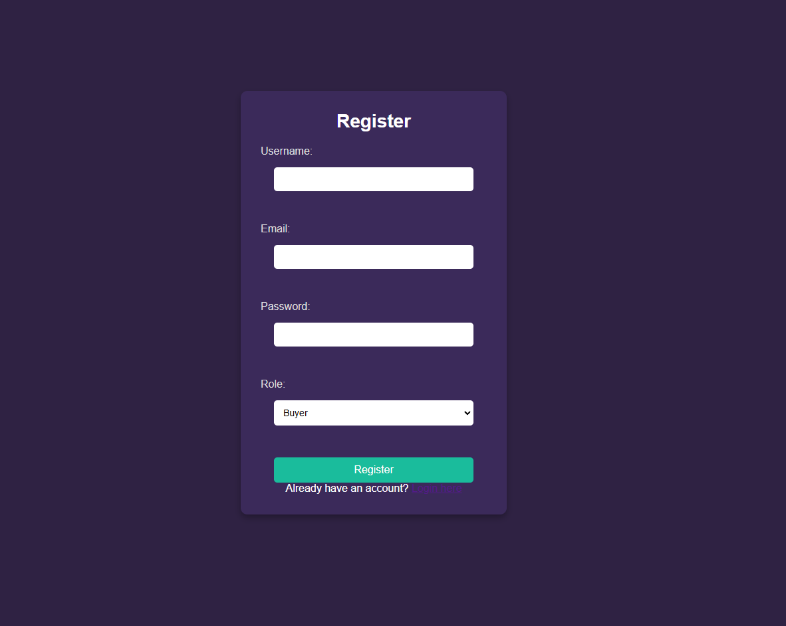
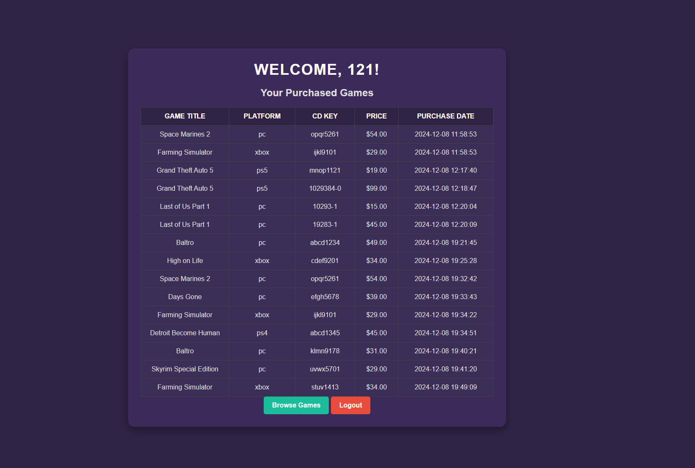
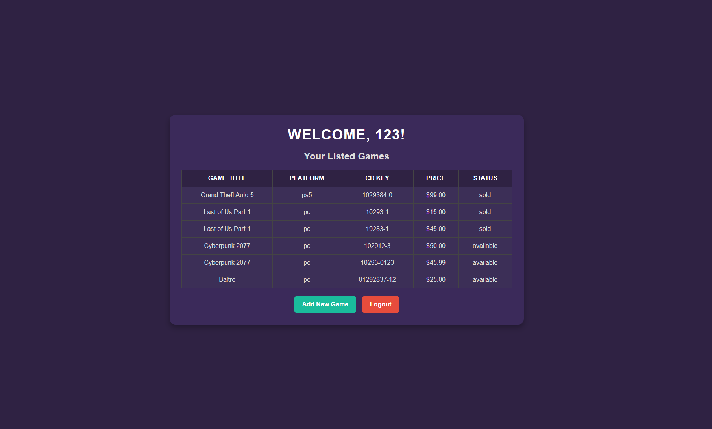

# CDKeys For Me

Welcome to **CDKeys For Me**, a responsive web application for purchasing CD keys for popular games at competitive prices. This project is designed to provide a clean, user-friendly interface for customers to browse, search, and purchase game keys easily.


---

## Features

### User-Facing Features
- **Catalog**:

  - A list of all the games we currently offer on the site.
  - Fully responsive and visually appealing layout.
  - Shows if a game is available or sold.
  - Allows users to buy the game right there in the menu (If Buyer Role).
  - Shows current promotions for games.
    
- **Login**:

  - A simple and visually appealing way to login to the website.
  - Allows users to buy games and see the keys for them once bought.

- **Register**:

  - An intuitive register page where the user puts some information in.
  - Allows users to create an account, either as a buyer or a seller.
 
- **Buyer View**:

  - A list of all the games the user might have bought.
  - Allows users to buy games from the catalog now.
  - User can grab the key for the game they bought if they forgot it earlier.
 
### Seller-Facing Features
- **Seller View**:

  - A list of all the games the seller currently has in the marketplace.
  - Shows if the game has been sold or not.

- **Selling A Game**:

  - Allows the seller to sell a game from the provided list.
  - Seller can provide the price and the key.
  - Shows up on their user page after adding.

### Technical Features
- **HTML, CSS, and PHP**:
  - Built with a modular structure using PHP for reusable components like headers and footers.
- **Responsive Design**:
  - The layout adapts to various screen sizes, ensuring usability on desktop and mobile devices.
- **Custom Styling**:
  - Tailored CSS to create a visually appealing interface with seamless navigation.
- **No JavaScript Dependency**:
  - Core functionality, such as the image carousel, relies solely on CSS, making the application lightweight.

---

## Project Structure

```
project-folder/
│
├── index.php               # Homepage of the site
├── header.php              # Header component
├── footer.php              # Footer component
├── css/                    
│   └──                     # Css styles specific to each webpage
│           
├── images/
│   └──                     # game cover art and also icons for header/footer
│   
├── github_images/
│   └──                     # github images for documentation
└── README.md               # Project documentation
```

---

## Installation

1. Clone this repository:
   ```bash
   git clone https://github.com/your-username/CSC-335-CDKey_DB.git
   ```
2. Set up a local server environment (e.g., XAMPP, WAMP, or MAMP).
3. Place the project folder in the server's root directory (e.g., `htdocs` for XAMPP).
4. Run the ```ddl_schema_creation.sql``` found inside the ```sql/``` folder.
5. Run all the creation of tables/databases and then insert statements. 
6. Open the project in a web browser:
   ```
   http://localhost/CSC-335-CDKey_DB
   ```
7. Register an account, and then enjoy playing around! 
---

## Usage

- Navigate through the homepage to explore the featured products.
- Use the search bar to find specific games.
- Browse game categories and explore discounted prices.
- Click on the "Buy Now" button for purchasing options.
- Activate the key for your platform and enjoy!

---

## Technologies Used

- **Frontend**:
  - HTML
  - CSS
- **Backend**:
  - PHP for reusable components and server-side logic.
  - SQL for queries and ddl statments.
- **Tools**:
  - Visual Studio Code for development.
  - Git for version control.
  - Local server environment (e.g., XAMPP).
  - MariaDB for SQL.

---

## Future Enhancements
- **Database Integration**:
  - Use MySQL to store and manage product data and user orders.
- **User Authentication**:
  - Add login and signup functionality for user accounts.
- **Payment Gateway**:
  - Integrate payment methods for completing purchases.

---

## License

This project is licensed under the MIT License. See the `LICENSE` file for details.
